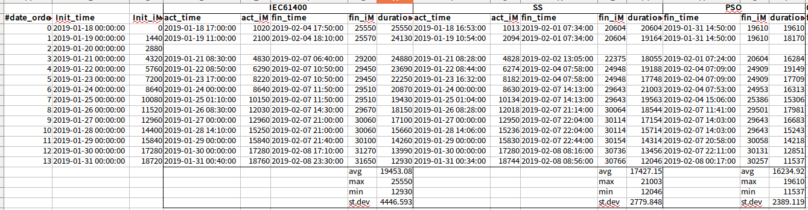

# Capture Matrix Optimization Paper preparation
1. Wind Data Analysis : (<a href='https://github.com/jehyunlee/tmp/blob/master/markdown/WindAnalysis.md'>Link</a>)  
2. Capture Matrix Contruction by  
  2-1. IEC61400 (<a href='https://github.com/jehyunlee/tmp/blob/master/markdown/IEC61400.md'>Link</a>)  
  2-2. Q-Learning (Link)  
  2-3. Particle Swarm (Link)  

*Summary :

