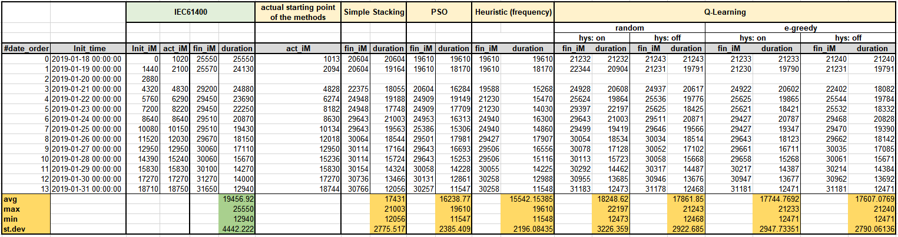

# Capture Matrix Optimization Paper preparation
1. Wind Data Analysis : (<a href='https://github.com/jehyunlee/tmp/blob/master/markdown/WindAnalysis.md'>Link</a>)  
2. Capture Matrix Contruction by  
  2-1. IEC61400 (<a href='https://github.com/jehyunlee/tmp/blob/master/markdown/IEC61400.md'>Link</a>)  
  2-2. Q-Learning (<a href='https://github.com/jehyunlee/tmp/blob/master/notebook/QL_analysis_all.ipynb'>Link</a>)  
  2-3. Particle Swarm (<a href='https://github.com/jehyunlee/tmp/blob/master/markdown/PSO_analysis.md'>Link</a>)  
       * Reliability check of PSO (<a href='https://github.com/jehyunlee/tmp/blob/master/notebook/PSO_analysis.ipynb'>Link</a>)
3. Comparison between Methods : (<a href='https://github.com/jehyunlee/tmp/blob/master/notebook/MethodsComp.ipynb'>Link</a>)

* Data Summary :  

* Method Comparison :  
1. Performance  

2. Gain  

