### Visualization of individual data on map with `folium`, `geoJSON` and `pandas DataFrame`

#### 1. Preparation
##### 1.1. Load `folium`
> official `github` : https://github.com/python-visualization/folium  
> documentation : https://python-visualization.github.io/folium/index.html  
> examples : https://nbviewer.jupyter.org/github/python-visualization/folium/tree/master/examples/  
> plugins : https://python-visualization.github.io/folium/plugins.html#folium-plugins  
> * sample 1 : https://dailyheumsi.tistory.com/85?category=815369  
> * sample 2 : https://dailyheumsi.tistory.com/92?category=815369  
  
> contributions : https://nbviewer.jupyter.org/github/python-visualization/folium_contrib/tree/master/notebooks/  


```python
import folium
```

##### 1.2. Function: capture `html` to `png`  
* This case is for `Firefox`.  
```python
browser = webdriver.Firefox()
```  
should be modified according to the browser.  
* Since the size of `html` is too large sometimes, `png` is preferred.  
* Large `html` file exceeds the maximum waiting time for rendering.
  - in this case, edit `browser.set_page_load_timeout(time_in_seconds)` part with larger number


```python
from selenium import webdriver
import time, os

!export PATH="/home/jehyun/PycharmProjects/selenium/:$PATH"

def html2png(m,                     # foium map instance
             html_name,             # str. ex. 'testmap.html'
             png_name='map.png',    # str. ex. 'testmap.png'
             delay=5,               # int or float. ex. 10
             ):

    delay=delay
    fn = 'html/' + html_name
    tmpurl='file://{path}/{mapfile}'.format(path=os.getcwd(),mapfile=fn)
    m.save(fn)

    browser = webdriver.Firefox()

    try:
        browser.set_page_load_timeout(600)
        browser.get(tmpurl)
        
    except TimeoutException as ex:
        isrunning = 0
        print("Exception has been thrown. " + str(ex))
        browser.close()

    #Give the map tiles some time to load
    time.sleep(delay)
    browser.save_screenshot('./images/'+png_name)
    browser.quit()
```

##### 1.3. Function : `pandas DataFrame` to `markdown`


```python
# Nice representation of dataframe in markdown
import pandas as pd
import copy
from IPython.display import Markdown, display

def df2md(df, maxlen=20):
    _df = copy.deepcopy(df)
    
    for col in _df.columns:
        _df[col] = _df[col].astype('str')
        if (_df[col].str.len()> maxlen).any() :
            _df[col].loc[_df[col].str.len() > maxlen] = _df[col].str.slice(stop=maxlen) + ' ...'

    if '(index)' not in _df.columns:
        _df.insert(0, '(index)', df.index)
        
    fmt = ['---' for i in range(len(_df.columns))]
    df_fmt = pd.DataFrame([fmt], columns=_df.columns)
    df_formatted = pd.concat([df_fmt, _df])
    display(Markdown(df_formatted.to_csv(sep="|", index=False)))
    _df.drop(columns='(index)', axis=1, inplace=True)
```

#### 2. Load Data
##### 2.1. Solar Radiation data on each buildings in Daejeon


```python
df = pd.read_excel('NGL.xlsx')
df.drop(index=0, inplace=True)
df.reset_index(drop=True, inplace=True)
df2md(df.head())
```


(index)|gid|buld_se_cd|buld_se_nm|bdtyp_cd|apt_yn|gro_flo_co|sig_cd|sig_nm|emd_cd|emd_nm|tm_x|tm_y|lon|lat|buld_area|buld_elev|m01|m02|m03|m04|m05|m06|m07|m08|m09|m10|m11|m12|y17|st_m01|st_m02|st_m03|st_m04|st_m05|st_m06|st_m07|st_m08|st_m09|st_m10|st_m11|st_m12|st_y17
---|---|---|---|---|---|---|---|---|---|---|---|---|---|---|---|---|---|---|---|---|---|---|---|---|---|---|---|---|---|---|---|---|---|---|---|---|---|---|---|---|---|---
0|24300|0|지상|4299|N|1|30110|동구|30110137|대별동|241302.419829207|409864.414379324|127.459746194608|36.2858798245272|199.109760164108|80|61.587998174704|76.368132857176|108.372413947032|130.399191728005|153.301471581826|138.981246232986|94.1192299952874|116.160557618508|107.075909293615|76.0582836270332|63.2461349872442|57.7913106771616|1183.46187899663|77.4414291381836|97.5647354125977|136.456909179688|159.853820800781|181.146118164063|161.53076171875|109.31169128418|138.931045532227|133.254684448242|95.6145782470703|80.3922271728516|72.975700378418|1444.47375488281
1|16295|0|지상|1001|N|1|30110|동구|30110105|가오동|240815.01297069|412384.958080419|127.454452653456|36.3086147051094|77.3923177693719|71|54.6587660438136|74.3240604024184|109.983418941498|131.021371841431|148.915192252711|136.026762912148|91.4622986442164|112.346493419848|109.010571178637|75.9642522084086|59.7529277174096|48.7103261571181|1152.17643617329|77.5996551513672|96.7234191894531|136.413635253906|159.390518188477|180.87614440918|165.518310546875|112.231346130371|137.366897583008|134.195907592773|96.3771133422852|79.9522476196289|72.7179718017578|1449.36315917969
2|24341|0|지상|1001|N|1|30110|동구|30110137|대별동|241460.822383503|410090.94543095|127.461521377075|36.2879144426327|91.0763856790575|77|62.304043189339|78.0388102324113|110.389678457509|130.250699416451|150.068157859471|135.022302627563|92.2708638232687|114.937465916509|108.497603748156|77.568351952926|64.5584099811056|58.3052325248718|1182.21162281866|77.4414291381836|97.5647354125977|136.456909179688|159.853820800781|181.146118164063|161.53076171875|109.31169128418|138.931045532227|133.254684448242|95.6145782470703|80.3922271728516|72.975700378418|1444.47375488281
3|24345|0|지상|4402|N|1|30110|동구|30110137|대별동|241530.22297262|410067.763074595|127.462292655181|36.2877025481814|51.2017056163047|78|48.6805400936692|60.6419043452651|86.4692395528158|105.063324045252|123.864551473547|112.271188029536|75.3915986661558|93.4298842041581|85.6682357434873|60.3520038746021|50.0022062372278|45.6562534349936|947.490926106771|77.4414291381836|97.5647354125977|136.456909179688|159.853820800781|181.146118164063|161.53076171875|109.31169128418|138.931045532227|133.254684448242|95.6145782470703|80.3922271728516|72.975700378418|1444.47375488281
4|24374|0|지상|18999|N|1|30110|동구|30110137|대별동|241500.967910986|409605.204042476|127.461942445015|36.2835354035404|455.844166700596|80|67.2504756116031|84.0601618833709|119.429690775118|141.218664905481|162.556833049707|146.167080444202|99.8334377941332|124.410167208889|117.419092797396|83.4298420412499|69.2576492167356|62.8880742809229|1277.92121626201|77.4414291381836|97.5647354125977|136.456909179688|159.853820800781|181.146118164063|161.53076171875|109.31169128418|138.931045532227|133.254684448242|95.6145782470703|80.3922271728516|72.975700378418|1444.47375488281


##### 2.2. `JSON` files for Administrative districts


```python
# 'gu' and dong' data in Korea
gu = f'https://raw.githubusercontent.com/jehyunlee/data-snippet/master/Korea_gu_20.json' 
dong = f'https://raw.githubusercontent.com/jehyunlee/data-snippet/master/Korea_dong_20.json' 
```

###### 2.2.1. Function : Load `JSON` from web


```python
import json
import urllib.request

def read_webjson(url):
  with urllib.request.urlopen(url) as src:
    data = json.loads(src.read().decode(), encoding='utf-8')
    return data 
```

###### 2.2.2. Load `JSON` from web(gu) and local(dong)


```python
gu_data = read_webjson(gu)    # read 'gu' json from data-snippet

# read 'dong'
# For unknown reason, it is not possible to read from web.
dong_data = json.loads(open('./geojsons/Korea_dong_20.json', 'r', encoding='utf-8').read())
```

###### 2.2.3. Data Validataion


```python
# Extracting 'gu' data from JSON
gu_dj = {}
gu_dj_value = []
SIG_KOR_NM = []    # list of 'gu's

for key, value in gu_data.items():
  if key != 'features':
    gu_dj.update({key: value})
  else:
    for feature in gu_data['features']:
      properties = feature['properties']
      sig_cd = properties['SIG_CD']
      if sig_cd[:2] == '30':
        SIG_KOR_NM.append(properties['SIG_KOR_NM'])
        gu_dj_value.append(feature)
gu_dj['features'] = gu_dj_value
        
print('# of "gu"s in Daejeon = {}'.format(len(SIG_KOR_NM)))
print(SIG_KOR_NM)        

# save list of 'gu's in json format
with open("gu_dj.json","w", encoding='utf-8') as jsonfile:
        json.dump(gu_dj,jsonfile,ensure_ascii=False)
```

    # of "gu"s in Daejeon = 5
    ['동구', '중구', '서구', '유성구', '대덕구']


```python
import numpy as np

# 1. Grouping 'dong' data from Solar Radiation

df_dong = df.groupby(by='emd_nm').mean().reset_index()

# 2. Extracting 'dong' data from JSON
dong_dj = {}
dong_dj_value = []
EMD_KOR_NM = []    # list of 'dong's

for key, value in dong_data.items():
  if key != 'features':
    dong_dj.update({key: value})
  else:
    for feature in dong_data['features']:
      properties = feature['properties']
      emd_cd = properties['EMD_CD']
      if emd_cd[:2] == '30': # 'dong' filter : only in Daejeon
        EMD_KOR_NM.append(properties['EMD_KOR_NM'])
        dong_dj_value.append(feature)
dong_dj['features'] = dong_dj_value

print('# of "dong"s in Daejeon(JSON) = {}'.format(len(EMD_KOR_NM)))  # Wrong Value : Duplicates exist 
print(sorted(EMD_KOR_NM))  

# 3. Find duplicates - geoJSON compression might have caused geometric split
import collections
print('\nDuplicates are {}'.format([item for item, count in collections.Counter(EMD_KOR_NM).items() if count > 1]))
EMD_KOR_NM = list(np.sort(np.unique(np.array(EMD_KOR_NM))))

print('\n# of  "dong"s in Daejeon(JSON, unique) = {}'.format(len(EMD_KOR_NM)))
print(sorted(EMD_KOR_NM))

# 4. Find missings - data from solar irradiation might have missing data
dong_solar = df_dong['emd_nm'].unique()
missing = []
for dong in EMD_KOR_NM:
  if dong not in dong_solar:
    missing.append(dong)
    
print('\nMissing "dong"s(Solar) = {}'.format(missing))

# 5. Save list of 'dong's in json format, including duplicates,
# because it is not important to treat them at the moment.
with open("dong_dj.json","w", encoding='utf-8') as jsonfile:
        json.dump(dong_dj,jsonfile,ensure_ascii=False)
```

    # of "dong"s in Daejeon(JSON) = 177
    ['가수원동', '가양동', '가오동', '가장동', '가정동', '갈마동', '갈전동', '갑동', '계산동', '관저동', '관평동', '괴곡동', '괴정동', '교촌동', '구도동', '구룡동', '구성동', '구암동', '구완동', '궁동', '금고동', '금동', '금탄동', '낭월동', '내동', '내탑동', '노은동', '대동', '대동', '대별동', '대사동', '대성동', '대정동', '대화동', '대흥동', '덕명동', '덕암동', '덕진동', '도룡동', '도마동', '도안동', '둔곡동', '둔산동', '마산동', '만년동', '매노동', '목달동', '목동', '목상동', '무수동', '문지동', '문창동', '문평동', '문화동', '미호동', '반석동', '방동', '방현동', '법동', '변동', '복수동', '복용동', '봉곡동', '봉명동', '봉산동', '부사동', '부수동', '비래동', '비룡동', '사성동', '사정동', '산성동', '산직동', '삼괴동', '삼성동', '삼정동', '삼정동', '상대동', '상서동', '상소동', '석교동', '석봉동', '선화동', '성남동', '성북동', '세동', '세천동', '소제동', '소호동', '송강동', '송정동', '송촌동', '수남동', '신대동', '신동', '신봉동', '신상동', '신성동', '신안동', '신일동', '신촌동', '신탄진동', '신하동', '신흥동', '안산동', '안영동', '어남동', '어은동', '연축동', '오동', '오동', '오류동', '오정동', '옥계동', '와동', '외삼동', '용계동', '용계동', '용두동', '용문동', '용산동', '용운동', '용전동', '용촌동', '용호동', '우명동', '원내동', '원동', '원신흥동', '원정동', '원촌동', '월평동', '유천동', '은행동', '읍내동', '이사동', '이현동', '인동', '자양동', '자운동', '장대동', '장동', '장동', '장안동', '장척동', '전민동', '정동', '정림동', '정생동', '주산동', '주촌동', '죽동', '중동', '중리동', '중촌동', '지족동', '직동', '천동', '추동', '추목동', '침산동', '탄방동', '탑립동', '태평동', '판암동', '평촌동', '평촌동', '하기동', '하소동', '학하동', '호동', '홍도동', '화암동', '황호동', '효동', '효평동', '흑석동']
    
    Duplicates are ['삼정동', '대동', '용계동', '오동', '평촌동', '장동']
    
    # of  "dong"s in Daejeon(JSON, unique) = 171
    ['가수원동', '가양동', '가오동', '가장동', '가정동', '갈마동', '갈전동', '갑동', '계산동', '관저동', '관평동', '괴곡동', '괴정동', '교촌동', '구도동', '구룡동', '구성동', '구암동', '구완동', '궁동', '금고동', '금동', '금탄동', '낭월동', '내동', '내탑동', '노은동', '대동', '대별동', '대사동', '대성동', '대정동', '대화동', '대흥동', '덕명동', '덕암동', '덕진동', '도룡동', '도마동', '도안동', '둔곡동', '둔산동', '마산동', '만년동', '매노동', '목달동', '목동', '목상동', '무수동', '문지동', '문창동', '문평동', '문화동', '미호동', '반석동', '방동', '방현동', '법동', '변동', '복수동', '복용동', '봉곡동', '봉명동', '봉산동', '부사동', '부수동', '비래동', '비룡동', '사성동', '사정동', '산성동', '산직동', '삼괴동', '삼성동', '삼정동', '상대동', '상서동', '상소동', '석교동', '석봉동', '선화동', '성남동', '성북동', '세동', '세천동', '소제동', '소호동', '송강동', '송정동', '송촌동', '수남동', '신대동', '신동', '신봉동', '신상동', '신성동', '신안동', '신일동', '신촌동', '신탄진동', '신하동', '신흥동', '안산동', '안영동', '어남동', '어은동', '연축동', '오동', '오류동', '오정동', '옥계동', '와동', '외삼동', '용계동', '용두동', '용문동', '용산동', '용운동', '용전동', '용촌동', '용호동', '우명동', '원내동', '원동', '원신흥동', '원정동', '원촌동', '월평동', '유천동', '은행동', '읍내동', '이사동', '이현동', '인동', '자양동', '자운동', '장대동', '장동', '장안동', '장척동', '전민동', '정동', '정림동', '정생동', '주산동', '주촌동', '죽동', '중동', '중리동', '중촌동', '지족동', '직동', '천동', '추동', '추목동', '침산동', '탄방동', '탑립동', '태평동', '판암동', '평촌동', '하기동', '하소동', '학하동', '호동', '홍도동', '화암동', '황호동', '효동', '효평동', '흑석동']
    
    Missing "dong"s(Solar) = ['부수동', '수남동', '황호동']


#### 3. Data Visualization
> How to use colormap with `folium` marker plot : https://stackoverflow.com/questions/56876620/unsure-how-to-use-colormap-with-folium-marker-plot  
> Colormap code-snippets : https://stackoverflow.com/questions/52911688/python-folium-choropleth-map-colors-incorrect/52981115#52981115  
> Colormap and other code-snippets : http://incredible.ai/code-snippet/2019/03/16/GeoHash-And-GeoPandas/  
> Color gradient code-snippets : https://stackoverflow.com/questions/25668828/how-to-create-colour-gradient-in-python  

##### 3.1. Find Map Center Coordination


```python
df['shadow'] = 1 - df['y17']/df['st_y17']
```


```python
# center of the map

lon_avg = df['lon'].mean()
lat_avg = df['lat'].mean()
print(lon_avg, lat_avg)
```

    127.4013580315068 36.340743659590096


##### 3.2. Function : Additive Color Operation 


```python
def add_color(c1, c2, c3, ipol=0):
    c1=np.array(mpl.colors.to_rgb(c1))
    c2=np.array(mpl.colors.to_rgb(c2))
    c3=np.array(mpl.colors.to_rgb(c3))
    if ipol < 0.5:
        # if c1 and c2 are parallel
        if np.dot(c1, c2) == np.linalg.norm(c1) * np.linalg.norm(c2):
            c = 2*((0.5-ipol)*c1 + ipol*c2)
        else:
            if ipol < 0.25:
                c = c1 + 4*ipol * c2
            elif ipol < 0.5:
                c = (2 - 4*ipol) * c1 + c2
    else:
        # if c2 and c3 are parallel
        if np.dot(c2, c3) == np.linalg.norm(c2) * np.linalg.norm(c3):
            c = 2*((1-ipol)*c2 + (ipol-0.5)*c3)
        else:
            if ipol < 0.75:
                c = c2 + (4*ipol-2) * c3
            else:
                c = (4 - 4*ipol) * c2 + c3
    
    if c.max() > 1:
        c = c/c.max()
        
    return mpl.colors.to_hex(c)
```

##### 3.3. Function : Map + Admistrative Districts + Data + Customized Colormap


```python
import branca
import branca.colormap as cm
import random
import matplotlib as mpl
import matplotlib.pyplot as plt
import numpy as np

def dj_datamap(df,               # pandas DataFrame
               col,              # column to plot in df
               *colors,          # colors for colormap formation : [c1, c2, c3]
               legend = None,    # legend. if None, 'col' is applied.
               datanum = None,   # number of data to plot. if None, all data.
               binmin = None,    # min. value of data to colorize
               binmax = None,    # max. value of data to colorize
               binstep = 5,      # number of bins 
               colortype = 'linear'  # 'linear' or 'step'
              ):
    # filename to be saved
    filename = '{}_{}'.format(col, legend)
    
    # folium map
    m = folium.Map(location=[lat_avg, lon_avg], 
                   tiles='CartoDB positron',
                   zoom_start=11)

    # style function for 'gu'
    style_function_gu = {
                    'opacity': 0.7,
                    'weight':1,
                    'fillOpacity': 1,
                    'color': 'black',
                    'fillColor': 'white'
                    }
    
    # style function for 'dong'
    style_function_dong = {
                    'opacity': 0.7,
                    'weight':1,
                    'fillOpacity': 0,
                    'color': 'gray',
                    'fillColor': 'white'
                    }

    # plot: adminstrative districts 'gu'
    folium.GeoJson(gu_dj, name='gu_dj',
                   style_function=lambda x: style_function_gu        # style_function has to be a function which calls dictionary
                  ).add_to(m)        # Overlay on map
    
    # plot : administrative districts 'dong'
    folium.GeoJson(dong_dj, name='dong_dj',
                   style_function=lambda x: style_function_dong        # style_function has to be a function which calls dictionary
                  ).add_to(m)        # Overlay on map

    # colormap settings
    # - values to colorize
    if binmin == None:
        vmin = df[col].min()
    else:
        vmin = binmin
        
    if binmax == None:    
        vmax = df[col].max()
    else:
        vmax = binmax
    
    # - number of data to plot
    if datanum == None:
        datanum = df.shape[0]
    
    # - colormap configuration
    c1 = colors[0][0]
    c2 = colors[0][1]
    c3 = colors[0][2]
    
    if colortype == 'linear':
        clrmap = cm.LinearColormap(colors=[c1, c2, c3], vmin=vmin, vmax=vmax)
    elif colortype == 'step':
        _colors = []
        for i in range(binstep):
            _colors.append(add_color(c1, c2, c3, i/(binstep-1)))
        
        #- colormap visualization
        bins = np.linspace(vmin, vmax, num=binstep+1)
    
        fig, axes = plt.subplots(figsize=(2,4), nrows=binstep+1, ncols=2, sharex=True)
        for i in range(binstep+1):
            rect = axes[i][0].patch
            rect.set_facecolor(_colors[binstep-i-1])
            if i == binstep:
                rect.set_alpha(0)
            axes[i][0].set_xlabel('')
            axes[i][0].set_ylabel('')
            axes[i][0].set_xticks([])
            axes[i][0].set_yticks([])
            axes[i][0].set_xticklabels([])
            axes[i][0].set_yticklabels([])
            axes[i][0].spines['top'].set_visible(True)
            axes[i][0].spines['right'].set_visible(False)
            axes[i][0].spines['bottom'].set_visible(False)
            axes[i][0].spines['left'].set_visible(False)
        for i in range(binstep+1):
            axes[i][1].text(0.1, 1, '{:2.2f}'.format(float(bins[binstep-i])), transform=axes[i][1].transAxes, fontsize=14, va='top', ha='left')
            axes[i][1].set_xlabel('')
            axes[i][1].set_ylabel('')
            axes[i][1].set_xticks([])
            axes[i][1].set_yticks([])
            axes[i][1].set_xticklabels([])
            axes[i][1].set_yticklabels([])
            axes[i][1].spines['top'].set_visible(False)
            axes[i][1].spines['right'].set_visible(False)
            axes[i][1].spines['bottom'].set_visible(False)
            axes[i][1].spines['left'].set_visible(False)
            
        plt.subplots_adjust(wspace=0, hspace=0, left=0.05, right=0.95, top=0.99, bottom=0.12)
        #plt.tight_layout()
        plt.savefig('./images/{}_legend.png'.format(filename))
        plt.show()
        
        clrmap = cm.StepColormap(colors=_colors, vmin=vmin, vmax=vmax,
                                index=np.linspace(vmin, vmax, binstep+1))
    
    # plot : data as markers (actually, dots)
    for idx in df.index[:datanum]:
        # Get longitude/latitude
        lon = df.at[idx, 'lon']
        lat = df.at[idx, 'lat']

        data = df.at[idx, col]
       
        folium.CircleMarker(
            location = [lat, lon],
            color='grey',
            fill_color=clrmap(data),
            fill_opacity=1,
            radius=0.5,
            weight=0
        ).add_to(m)
        
    # legend
    if colortype == 'linear':
        clrmap = clrmap.to_step(index=np.linspace(vmin, vmax, num=binstep))
    elif colortype == 'step':
        pass
    
    if legend == None:
        legend = col
    
    clrmap.caption=legend
    clrmap.add_to(m)

    # layer control ON
    folium.LayerControl().add_to(m)
    
    # save as file
    html2png(m, '{}.html'.format(filename), '{}.png'.format(filename))
    
    return _colors
```


```python

```


```python

```


```python

```


```python
colors = ['#ffff00', '#ffa000', '#ff6000']
```


```python
%matplotlib inline

n = 200
fig, ax = plt.subplots(figsize=(8, 5))
for x in range(n+1):
    color = add_color(colors[0],colors[1],colors[2], x/n)
    if x in [0, 50, 100, 150, 200]:
        print(color)
    ax.axvline(x, color=color, linewidth=4) 
plt.show()
```

    #ffff00
    #ffd000
    #ffa000
    #ff8000
    #ff6000


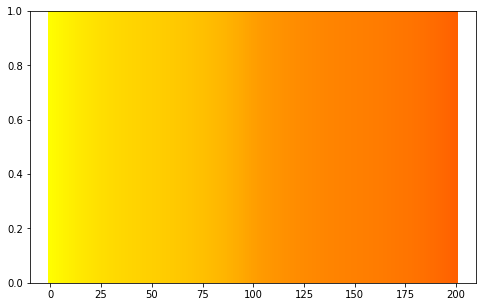


```python
dj_datamap(df, 'y17', colors, legend='radiation with shadows', datanum=None, binmin=550, binmax=1450, binstep=9, colortype='step')
```


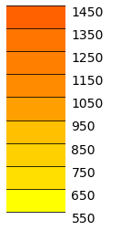


    ['#ffff00',
     '#ffdf00',
     '#ffd000',
     '#ffc000',
     '#ffa000',
     '#ff8b00',
     '#ff8000',
     '#ff7500',
     '#ff6000']


Note : the `html` file is about 70 MB, where `png` file is only about 640 KB.  


```python
colors = ['deepskyblue', 'blue', 'navy']
```


```python
%matplotlib inline

n = 200
fig, ax = plt.subplots(figsize=(8, 5))
for x in range(n+1):
    color = add_color(colors[0],colors[1],colors[2], x/n)
    if x in [0, 50, 100, 150, 200]:
        print(color)
    ax.axvline(x, color=color, linewidth=4) 
plt.show()
```

    #00bfff
    #0060ff
    #0000ff
    #0000c0
    #000080


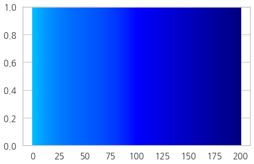


```python
dj_datamap(df, 'shadow', colors, legend='shadow', datanum=None, binmin=0, binmax=1, binstep=10, colortype='step')
```


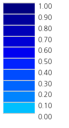


    ['#00bfff',
     '#0084ff',
     '#0065ff',
     '#004cff',
     '#0023ff',
     '#0000f1',
     '#0000d5',
     '#0000b8',
     '#00009c',
     '#000080']


```python
dj_datamap(df, 'shadow', colors, legend='shadow', datanum=None, binmin=0, binmax=1000, binstep=10, colortype='step')
```


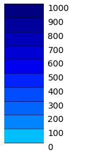


    ['#00bfff',
     '#0084ff',
     '#0065ff',
     '#004cff',
     '#0023ff',
     '#0000f1',
     '#0000d5',
     '#0000b8',
     '#00009c',
     '#000080']


```python
df['buld_elev'].sort_values(ascending=False)
df = df.loc[df['buld_elev'] < 350]
```


```python
df['gro_flo_co'].sort_values(ascending=False)
df = df.loc[df['gro_flo_co'] <= 40]
df['gro_flo_co'].sort_values(ascending=False)
```


    60780     40
    81842     39
    109500    39
    23403     36
    44697     36
    134616    36
    106864    36
    69846     36
    14816     35
    135474    35
    72532     35
    66609     35
    10896     35
    42721     35
    75861     34
    121968    34
    121970    34
    38899     34
    140449    33
    85098     33
    137316    33
    29587     32
    98434     32
    35313     32
    47995     32
    137647    32
    72822     32
    103570    32
    110014    31
    79942     31
              ..
    43938      0
    117628     0
    117629     0
    51580      0
    39406      0
    30261      0
    76273      0
    108858     0
    51496      0
    124470     0
    96060      0
    136449     0
    132894     0
    76142      0
    10150      0
    127512     0
    72363      0
    76153      0
    130201     0
    90132      0
    142167     0
    130215     0
    40839      0
    108977     0
    90072      0
    108967     0
    45267      0
    132813     0
    83990      0
    140558     0
    Name: gro_flo_co, Length: 147741, dtype: object


##### 3.4. Function : Distribution Visualization


```python
import seaborn as sns
sns.set(style='whitegrid')
sns.set(font_scale=1)

import platform
system = platform.system()
print(system)

# -*- coding: UTF-8 -*-
%matplotlib inline  

import matplotlib as mpl  # 기본 설정 만지는 용도
import matplotlib.pyplot as plt  # 그래프 그리는 용도
import matplotlib.font_manager as fm  # 폰트 관련 용도

print ('버전: ', mpl.__version__)
print ('설치 위치: ', mpl.__file__)
print ('설정 위치: ', mpl.get_configdir())
print ('캐시 위치: ', mpl.get_cachedir())
print ('설정 파일 위치: ', mpl.matplotlib_fname())
font_list = fm.findSystemFonts(fontpaths=None, fontext='ttf')

if system == 'Windows':
    datapath = os.getcwd() + '\\'
    imagepath = datapath + 'images\\'

    # ttf 폰트 전체개수
    print(len(font_list))
    font_list[:10]

    f = [f.name for f in fm.fontManager.ttflist]
    print(len(font_list))
    f[:10]

    [(f.name, f.fname) for f in fm.fontManager.ttflist if 'Nanum' in f.name]

    path = 'C:\\Windows\\Fonts\\NanumBarunGothic.ttf'
    font_name = fm.FontProperties(fname=path, size=50).get_name()

    print(font_name)
    plt.rc('font', family=font_name)
  
elif system == 'Linux':
    datapath = os.getcwd() + '//'
    imagepath = datapath + 'images//'

#     !apt-get update -qq
#     !apt-get install fonts-nanum* -qq

    path = '/usr/share/fonts/truetype/nanum/NanumGothic.ttf'  # 설치된 나눔글꼴중 원하는 녀석의 전체 경로를 가져오자
    font_name = fm.FontProperties(fname=path, size=10).get_name()

    print(font_name)
    plt.rc('font', family=font_name)

    fm._rebuild()
    mpl.rcParams['axes.unicode_minus'] = False
  
else:
    print('# Sorry, my code has compatibility with Windows and Linux only.')
    exit(0)
```

    Linux
    버전:  3.1.0
    설치 위치:  /home/jehyun/anaconda3/lib/python3.7/site-packages/matplotlib/__init__.py
    설정 위치:  /home/jehyun/.config/matplotlib
    캐시 위치:  /home/jehyun/.cache/matplotlib
    설정 파일 위치:  /home/jehyun/anaconda3/lib/python3.7/site-packages/matplotlib/mpl-data/matplotlibrc
    NanumGothic


```python
# Figure style setting
sns.set_style('whitegrid')
sns.palplot(sns.color_palette('muted'))
sns.set_context("talk")
plt.rc('font', family=font_name)
fm._rebuild()
mpl.rcParams['axes.unicode_minus'] = False
```


```python
import numpy as np
def dist_plot(df, xk, xv):

    fig, ax = plt.subplots(figsize=(6,6))
    f = sns.distplot(df[xk], kde=False, rug=False)

    if xv == '건물 면적':
        f.set(yscale='log')

    mean_val = df[xk].mean()
    std_val = df[xk].std()
    max_val = df[xk].max()
    min_val = df[xk].min()
    
    print('{}: mean= {:.2f}, st.dev.= {:.2f}, min= {:.2f}, max= {:.2f}'.format(xk, mean_val, std_val, min_val, max_val))

#     fig.text(0.3,0.8, '     mean : {:>3.02f}'.format(mean_val), fontsize=16)
#     fig.text(0.3,0.75, '        std : {:>3.02f}'.format(std_val), fontsize=16)
#     fig.text(0.3,0.7, '       max : {:>3.02f}'.format(max_val), fontsize=16)
#     fig.text(0.3,0.65, '       min : {:>3.02f}'.format(min_val), fontsize=16)

    # The most frequent bin
    heights = [h.get_height() for h in f.patches]
    index_max = np.argmax(heights)
#     max_x = f.patches[index_max].get_x() + np.array([0, f.patches[index_max].get_width()/2])
#     fig.text(0.3,0.6, 'max bin : {:>.02f}~{:>.02f}'.format(max_x[0], max_x[1]), fontsize=16, color='blue')
#     f.patches[index_max].set_color('blue')

    f.set(xlabel=xv)
    plt.tight_layout()
    f.figure.savefig('./images/distrib_{}.png'.format(xv))
```


```python
xs = {
    'gro_flo_co' : '지상 층수',
    'buld_area' : '건물 면적',
    'buld_elev' : '건물 표고',
    'y17' : '음영반영 일사량',
    'st_y17': '위성일사량',
    'shadow': '음영 기인 일사량 손실률'
}
```


```python
for xk, xv in xs.items():
    dist_plot(df, xk, xv)
```

    gro_flo_co: mean= 2.22, st.dev.= 2.61, min= 0.00, max= 40.00
    buld_area: mean= 186.51, st.dev.= 773.33, min= 0.09, max= 130409.55
    buld_elev: mean= 64.72, st.dev.= 24.00, min= 0.00, max= 347.80
    y17: mean= 1080.84, st.dev.= 146.16, min= 0.00, max= 1457.28
    st_y17: mean= 1445.17, st.dev.= 7.22, min= 1429.47, max= 1482.60
    shadow: mean= 0.25, st.dev.= 0.10, min= -0.00, max= 1.00


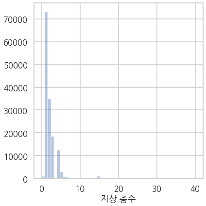


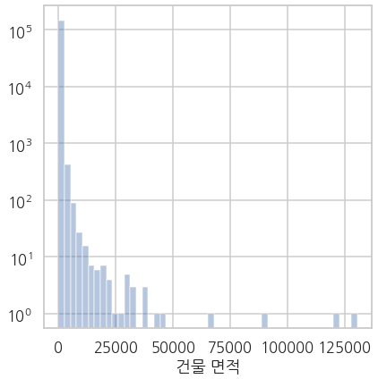


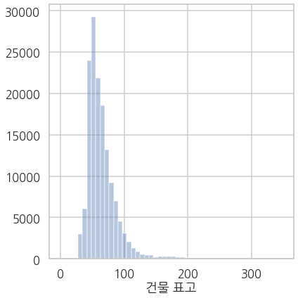


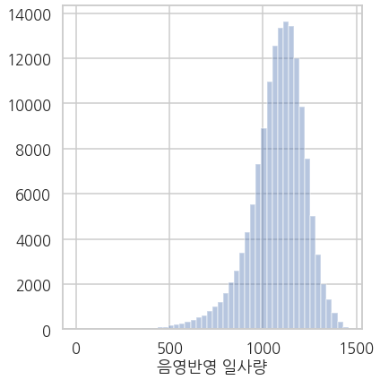


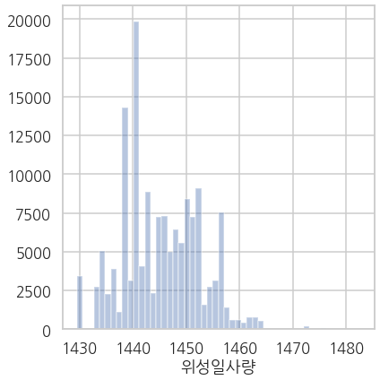


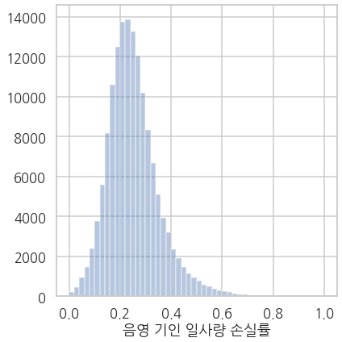


```python
flo_1 = df[df['gro_flo_co'] >= 10].shape[0]
print(flo_1)

print(flo_1/147754)
```

    3169
    0.021447811903569446


```python
area_1 = df[df['buld_area'] < 1000].shape[0]
print(area_1)

print(area_1/df.shape[0])
```

    144971
    0.9812509729865102


```python
df['gro_flo_co'] = df['gro_flo_co'].astype('int')
```


```python
print(df.columns)
df2md(df.head())
col_del = ['gid', 'buld_se_cd', 'buld_se_nm', 'bdtyp_cd', 'apt_yn','sig_cd', 'sig_nm', 'emd_cd', 'emd_nm', 'm01', 'm02', 'm03', 'm04', 'm05', 'm06',\
       'm07', 'm08', 'm09', 'm10', 'm11', 'm12','st_m01', 'st_m02','st_m03', 'st_m04', 'st_m05', 'st_m06', 'st_m07', 'st_m08', 'st_m09','st_m10', 'st_m11', 'st_m12', ]
df1 = df.drop(columns=col_del)
df2md(df1.head())
```

    Index(['gid', 'buld_se_cd', 'buld_se_nm', 'bdtyp_cd', 'apt_yn', 'gro_flo_co',
           'sig_cd', 'sig_nm', 'emd_cd', 'emd_nm', 'tm_x', 'tm_y', 'lon', 'lat',
           'buld_area', 'buld_elev', 'm01', 'm02', 'm03', 'm04', 'm05', 'm06',
           'm07', 'm08', 'm09', 'm10', 'm11', 'm12', 'y17', 'st_m01', 'st_m02',
           'st_m03', 'st_m04', 'st_m05', 'st_m06', 'st_m07', 'st_m08', 'st_m09',
           'st_m10', 'st_m11', 'st_m12', 'st_y17', 'shadow'],
          dtype='object')


(index)|gid|buld_se_cd|buld_se_nm|bdtyp_cd|apt_yn|gro_flo_co|sig_cd|sig_nm|emd_cd|emd_nm|tm_x|tm_y|lon|lat|buld_area|buld_elev|m01|m02|m03|m04|m05|m06|m07|m08|m09|m10|m11|m12|y17|st_m01|st_m02|st_m03|st_m04|st_m05|st_m06|st_m07|st_m08|st_m09|st_m10|st_m11|st_m12|st_y17|shadow
---|---|---|---|---|---|---|---|---|---|---|---|---|---|---|---|---|---|---|---|---|---|---|---|---|---|---|---|---|---|---|---|---|---|---|---|---|---|---|---|---|---|---|---
0|24300|0|지상|4299|N|1|30110|동구|30110137|대별동|241302.419829207|409864.414379324|127.459746194608|36.2858798245272|199.109760164108|80|61.587998174704|76.368132857176|108.372413947032|130.399191728005|153.301471581826|138.981246232986|94.1192299952874|116.160557618508|107.075909293615|76.0582836270332|63.2461349872442|57.7913106771616|1183.46187899663|77.4414291381836|97.5647354125977|136.456909179688|159.853820800781|181.146118164063|161.53076171875|109.31169128418|138.931045532227|133.254684448242|95.6145782470703|80.3922271728516|72.975700378418|1444.47375488281|261.01187588617995
1|16295|0|지상|1001|N|1|30110|동구|30110105|가오동|240815.01297069|412384.958080419|127.454452653456|36.3086147051094|77.3923177693719|71|54.6587660438136|74.3240604024184|109.983418941498|131.021371841431|148.915192252711|136.026762912148|91.4622986442164|112.346493419848|109.010571178637|75.9642522084086|59.7529277174096|48.7103261571181|1152.17643617329|77.5996551513672|96.7234191894531|136.413635253906|159.390518188477|180.87614440918|165.518310546875|112.231346130371|137.366897583008|134.195907592773|96.3771133422852|79.9522476196289|72.7179718017578|1449.36315917969|297.1867230063999
2|24341|0|지상|1001|N|1|30110|동구|30110137|대별동|241460.822383503|410090.94543095|127.461521377075|36.2879144426327|91.0763856790575|77|62.304043189339|78.0388102324113|110.389678457509|130.250699416451|150.068157859471|135.022302627563|92.2708638232687|114.937465916509|108.497603748156|77.568351952926|64.5584099811056|58.3052325248718|1182.21162281866|77.4414291381836|97.5647354125977|136.456909179688|159.853820800781|181.146118164063|161.53076171875|109.31169128418|138.931045532227|133.254684448242|95.6145782470703|80.3922271728516|72.975700378418|1444.47375488281|262.2621320641499
3|24345|0|지상|4402|N|1|30110|동구|30110137|대별동|241530.22297262|410067.763074595|127.462292655181|36.2877025481814|51.2017056163047|78|48.6805400936692|60.6419043452651|86.4692395528158|105.063324045252|123.864551473547|112.271188029536|75.3915986661558|93.4298842041581|85.6682357434873|60.3520038746021|50.0022062372278|45.6562534349936|947.490926106771|77.4414291381836|97.5647354125977|136.456909179688|159.853820800781|181.146118164063|161.53076171875|109.31169128418|138.931045532227|133.254684448242|95.6145782470703|80.3922271728516|72.975700378418|1444.47375488281|496.982828776039
4|24374|0|지상|18999|N|1|30110|동구|30110137|대별동|241500.967910986|409605.204042476|127.461942445015|36.2835354035404|455.844166700596|80|67.2504756116031|84.0601618833709|119.429690775118|141.218664905481|162.556833049707|146.167080444202|99.8334377941332|124.410167208889|117.419092797396|83.4298420412499|69.2576492167356|62.8880742809229|1277.92121626201|77.4414291381836|97.5647354125977|136.456909179688|159.853820800781|181.146118164063|161.53076171875|109.31169128418|138.931045532227|133.254684448242|95.6145782470703|80.3922271728516|72.975700378418|1444.47375488281|166.55253862080008


(index)|gro_flo_co|tm_x|tm_y|lon|lat|buld_area|buld_elev|y17|st_y17|shadow
---|---|---|---|---|---|---|---|---|---|---
0|1|241302.419829207|409864.414379324|127.459746194608|36.2858798245272|199.109760164108|80|1183.46187899663|1444.47375488281|261.01187588617995
1|1|240815.01297069|412384.958080419|127.454452653456|36.3086147051094|77.3923177693719|71|1152.17643617329|1449.36315917969|297.1867230063999
2|1|241460.822383503|410090.94543095|127.461521377075|36.2879144426327|91.0763856790575|77|1182.21162281866|1444.47375488281|262.2621320641499
3|1|241530.22297262|410067.763074595|127.462292655181|36.2877025481814|51.2017056163047|78|947.490926106771|1444.47375488281|496.982828776039
4|1|241500.967910986|409605.204042476|127.461942445015|36.2835354035404|455.844166700596|80|1277.92121626201|1444.47375488281|166.55253862080008


```python
df1['h_abs'] = df1['buld_elev'] + 3.14 * df1['gro_flo_co']
df2md(df1.head())
```


(index)|gro_flo_co|tm_x|tm_y|lon|lat|buld_area|buld_elev|y17|st_y17|shadow|h_abs
---|---|---|---|---|---|---|---|---|---|---|---
0|1|241302.419829207|409864.414379324|127.459746194608|36.2858798245272|199.109760164108|80|1183.46187899663|1444.47375488281|261.01187588617995|83.14
1|1|240815.01297069|412384.958080419|127.454452653456|36.3086147051094|77.3923177693719|71|1152.17643617329|1449.36315917969|297.1867230063999|74.14
2|1|241460.822383503|410090.94543095|127.461521377075|36.2879144426327|91.0763856790575|77|1182.21162281866|1444.47375488281|262.2621320641499|80.14
3|1|241530.22297262|410067.763074595|127.462292655181|36.2877025481814|51.2017056163047|78|947.490926106771|1444.47375488281|496.982828776039|81.14
4|1|241500.967910986|409605.204042476|127.461942445015|36.2835354035404|455.844166700596|80|1277.92121626201|1444.47375488281|166.55253862080008|83.14


* 인접 건물 추출


```python
from sklearn.neighbors import KDTree
from numpy import array


def nearestBuild(build_data , meter) :

    start = time.time()

    # gu_locat
    xylocation = pd.DataFrame()
    xylocation['tm_x'] = build_data['tm_x']
    xylocation['tm_y'] = build_data['tm_y']
    xylocation['tm_x'] = xylocation['tm_x'].astype(float)
    xylocation['tm_y'] = xylocation['tm_y'].astype(float)
    # xylocation['gid'] = build_data['gid']
    # 위의 gid를 넣으면 이 값 까지 계산해서 거리를 잰다 

    xylocation_list = xylocation.values.tolist()
    xylocation_np = array(xylocation_list)
    tree = KDTree(xylocation_np)


    realnearest_ind = []
    realnearest_dist = []

    build_count_list = []
    realnearest_ind_list = []
    realnearest_dist_list = []

    for i in range(len(xylocation_np)) :

        # 기준 빌딩의 xy좌표와 최단거리에 있는 1000개의 인접 빌딩들을 탐색
        nearest_dist , nearest_ind = tree.query([xylocation_np[i]] , k = 1000)

        for j in range(1,len(nearest_dist[0])) :
            
            # 100 미터 안이고
            if nearest_dist[0][j] <= meter : 


                # 남쪽 + 양쪽 30도 위에도 포함
#                 buildsAngle = np.arctan2(xylocation_np[i][1]-xylocation_np[nearest_ind[0][j]][1] , xylocation_np[i][0]-xylocation_np[nearest_ind[0][j]][0])  * 180 /  np.pi

#                 if not ( -150 < buildsAngle <-30 ) :    
#                     realnearest_ind.append(nearest_ind[0][j])
#                     realnearest_dist.append(nearest_dist[0][j])


    #           남쪽에있는 빌딩들 만을 위한 처리 
                if  xylocation_np[i][1]-xylocation_np[nearest_ind[0][j]][1] > 0 :
                    realnearest_ind.append(nearest_ind[0][j])
                    realnearest_dist.append(nearest_dist[0][j])

            else :
                break

        nearest_ind = np.delete(nearest_ind[0][:j] , 0)
        build_count_list.append(len(realnearest_ind))
        realnearest_ind_list.append(realnearest_ind)
        realnearest_dist_list.append(realnearest_dist)

        realnearest_ind = []
        realnearest_dist = []
    
    # 조건에 맞는 빌딩이 없는경우 자기 자신을 넣준다 ( 에러방지 , 빈 list가 있다면 에러가 남 )
    nearZero_list = []
    for i in range(len(realnearest_ind_list)) :
        if len(realnearest_ind_list[i]) == 0 :
            nearZero_list.append(i)
            realnearest_ind_list[i].append(i)
            realnearest_dist_list[i].append(0)

    print("find nearestBuild time :", time.time() - start) 

    
    return realnearest_ind_list , realnearest_dist_list , nearZero_list


df1['tm_x'] = df1['tm_x'].astype(float)
df1['tm_y'] = df1['tm_y'].astype(float)
realnearest_ind_list , realnearest_dist_list , nearZero_list = nearestBuild(df1 , 100)
```

    find nearestBuild time : 45.476884603500366


```python
def minmaxCheck(realnearest_dist_list) :
    maxNum = 0 
    minNum = 100000
    maxIdx = 0
    minIdx = 0
    for i in range(len(realnearest_dist_list)) :
        for num in realnearest_dist_list[i] :
            if num > maxNum :
                maxNum = num
                maxIdx = i
            if minNum > num and num > 0 :
                minNum = num
                minIdx = i
    print("Dist min 값 : " , minNum , "max 값 : " , maxNum)
    print("Dist min idx : " , minIdx , "max idx : " , maxIdx)
    return minIdx , maxIdx

minIdx , maxIdx =  minmaxCheck(realnearest_dist_list)
```

    Dist min 값 :  0.6699526599160539 max 값 :  99.99997302055972
    Dist min idx :  145740 max idx :  59332


```python
def validifyDisZero(realnearest_dist_list) :
    for i in range(len(realnearest_dist_list)) :
        for num in realnearest_dist_list[i] :
            if num == 0 :
                if i != realnearest_ind_list[i][0] :
                    print(str(i) +"번째 인덱스 에러")
                    return 0
    
    print("> 빈 list 없음")

validifyDisZero(realnearest_dist_list)
```

    > 빈 list 없음


```python
df1['lon'] = df1['lon'].astype('float')
df1['lat'] = df1['lat'].astype('float')
```


```python
def checkCalAngle(df, idx_tgt ) :

    # filename to be saved
    filename = 'near_{}'.format(idx_tgt)
    
    # folium map
    idx_lat = df['lat'].loc[idx_tgt]
    idx_lon = df['lon'].loc[idx_tgt]
    m = folium.Map(location=[idx_lat, idx_lon], 
                   tiles='CartoDB positron',
                   zoom_start=13)
    
    # target building
    folium.CircleMarker(
            location = [idx_lat, idx_lon],
            color='red',
            fill_color='red',
            fill_opacity=1,
            radius=10,
            weight=0
        ).add_to(m)
    
    # plot : data as markers (actually, dots)
    dist = realnearest_dist_list[idx_tgt]
    for i in range(len(realnearest_ind_list[idx_tgt])):
        idx = realnearest_ind_list[idx_tgt][i]
        # Get longitude/latitude
        lon = df['lon'].loc[idx]
        lat = df['lat'].loc[idx]
        print(lon, lat)
        
        if i == 0:
            color = 'blue'
        else:
            color = 'black'
            
        folium.CircleMarker(
            location = [lat, lon],
            color='black',
            fill_color=color,
            fill_opacity=0.5,
            radius=5,
            weight=0,
            popup = realnearest_dist_list[idx_tgt][i]
        ).add_to(m)
        
          
            
    # save as file
    html2png(m, '{}.html'.format(filename), '{}.png'.format(filename))

```


```python
def check_n_run(df, idx):
    subset = pd.DataFrame({'idx':realnearest_ind_list[idx], 
                           'dist':realnearest_dist_list[idx]})
    print(subset.shape)
    df2md(subset)
    checkCalAngle(df, idx )
```


```python
check_n_run(df1, 0)
```

    (26, 2)


(index)|idx|dist
---|---|---
0|73955|13.532133963279891
1|120146|21.596315106145994
2|9266|25.855557210560026
3|137866|32.772468882165974
4|26656|35.806688161182244
5|119830|47.02419950641303
6|45235|51.164532606365206
7|63792|52.358434971825595
8|26657|53.141710950122324
9|119269|54.75078398687052
10|17282|55.376492079549834
11|8012|58.21372947054864
12|91692|63.48694503766112
13|82473|70.49829236290618
14|45236|70.67026259965367
15|96015|70.82120747369889
16|129445|76.47250935875135
17|31388|77.78930957216672
18|18597|78.10517396639115
19|35899|79.93439634435447
20|31661|85.64573909069155
21|101675|88.47980920662756
22|102878|89.73878204854529
23|129444|92.42632026448118
24|9058|97.72059031742533
25|63794|98.36519896681955


    127.455263603485 36.2674395086325
    127.454752403412 36.2675485511377
    127.446306423177 36.3172481931722
    127.461309166712 36.3215575457324
    127.459194523359 36.2862679684196
    127.42731179051 36.3534303609667
    127.458388637808 36.276612176723
    127.443225957427 36.3344857510127
    127.459575371255 36.2855882846985
    127.424249671265 36.4392818405083
    127.456931990069 36.2818323064143
    127.458787487022 36.2846008728287
    127.435369721476 36.2555433227519
    127.426245735868 36.3451436932867
    127.458239180323 36.2852026191332
    127.480296433242 36.257780369269
    127.438855607945 36.2519471739923
    127.367368671745 36.3330844197134
    127.400823021854 36.3170343354564
    127.436890978702 36.2562724447136
    127.341369417218 36.2348597298779
    127.45582782352 36.2683010490373
    127.442815804671 36.2238435397705
    127.439444450594 36.2520609029733
    127.459880633356 36.2860110252287
    127.448829695435 36.3678942707051


    ---------------------------------------------------------------------------

    WebDriverException                        Traceback (most recent call last)

    <ipython-input-118-959251171b10> in <module>
    ----> 1 check_n_run(df, 0)
    

    <ipython-input-112-5b774c11cebf> in check_n_run(df, idx)
          4     print(subset.shape)
          5     df2md(subset)
    ----> 6     checkCalAngle(df, idx )
    

    <ipython-input-115-acbb97416d1e> in checkCalAngle(df, idx_tgt)
         48 
         49     # save as file
    ---> 50     html2png(m, '{}.html'.format(filename), '{}.png'.format(filename))
    

    <ipython-input-3-c9e3cd351035> in html2png(m, html_name, png_name, delay)
         28     #Give the map tiles some time to load
         29     time.sleep(delay)
    ---> 30     browser.save_screenshot('./images/'+png_name)
         31     browser.quit()


    ~/anaconda3/lib/python3.7/site-packages/selenium/webdriver/remote/webdriver.py in save_screenshot(self, filename)
       1053             driver.save_screenshot('/Screenshots/foo.png')
       1054         """
    -> 1055         return self.get_screenshot_as_file(filename)
       1056 
       1057     def get_screenshot_as_png(self):


    ~/anaconda3/lib/python3.7/site-packages/selenium/webdriver/remote/webdriver.py in get_screenshot_as_file(self, filename)
       1030             warnings.warn("name used for saved screenshot does not match file "
       1031                           "type. It should end with a `.png` extension", UserWarning)
    -> 1032         png = self.get_screenshot_as_png()
       1033         try:
       1034             with open(filename, 'wb') as f:


    ~/anaconda3/lib/python3.7/site-packages/selenium/webdriver/remote/webdriver.py in get_screenshot_as_png(self)
       1062             driver.get_screenshot_as_png()
       1063         """
    -> 1064         return base64.b64decode(self.get_screenshot_as_base64().encode('ascii'))
       1065 
       1066     def get_screenshot_as_base64(self):


    ~/anaconda3/lib/python3.7/site-packages/selenium/webdriver/remote/webdriver.py in get_screenshot_as_base64(self)
       1072             driver.get_screenshot_as_base64()
       1073         """
    -> 1074         return self.execute(Command.SCREENSHOT)['value']
       1075 
       1076     def set_window_size(self, width, height, windowHandle='current'):


    ~/anaconda3/lib/python3.7/site-packages/selenium/webdriver/remote/webdriver.py in execute(self, driver_command, params)
        319         response = self.command_executor.execute(driver_command, params)
        320         if response:
    --> 321             self.error_handler.check_response(response)
        322             response['value'] = self._unwrap_value(
        323                 response.get('value', None))


    ~/anaconda3/lib/python3.7/site-packages/selenium/webdriver/remote/errorhandler.py in check_response(self, response)
        240                 alert_text = value['alert'].get('text')
        241             raise exception_class(message, screen, stacktrace, alert_text)
    --> 242         raise exception_class(message, screen, stacktrace)
        243 
        244     def _value_or_default(self, obj, key, default):


    WebDriverException: Message: Failed to decode response from marionette


```python
print('"0"\n{}'.format(df1[['tm_x', 'tm_y']].loc[0]))
print('"73955"\n{}'.format(df1[['tm_x', 'tm_y']].loc[73955]))
```

    "0"
    tm_x    241302.419829
    tm_y    409864.414379
    Name: 0, dtype: float64
    "73955"
    tm_x    240909.333200
    tm_y    407816.278003
    Name: 73955, dtype: float64


```python

```
