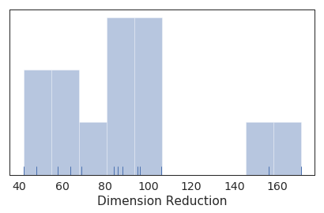

```python
import pandas as pd
import numpy as np
import matplotlib.pyplot as plt
import os
import seaborn as sns

sns.set_style('white')
sns.set_context('talk')
sns.set_palette('Blues_r')
sns.set(color_codes=True)


```

* Filter: csv file


```python
filelist = os.listdir()
csvlist = [file for file in filelist if file.endswith('.csv')]
len(csvlist)
```


    401


* Arrange: csv files


```python
datemax = 13    # 0~12
datelist = np.arange(datemax)
eval_summary = pd.DataFrame()

# Reference Original data
data = pd.read_excel('Hyosung_iM.xlsx')

# iterate files by date_order
num_iter = 30

for date in datelist:
    print(date)
    testlist = [file for file in csvlist if (file.split('_')[2] == str(date))]
    testlistlen = len(testlist)
    
    dim_final = np.array([], dtype=np.int)
    iM_final = np.array([], dtype=np.int)
    
    # Anaysis on each .csv file
    for i in range(testlistlen):
        testfile = testlist[i]
        repeat = int(testfile.split('_')[3][1:])
        test_df = pd.read_csv(testfile, header=None, na_values=[' nan'])
        
        test_df_dim_init = int(test_df.head(1).loc[:, 0])
        test_df_dim_final = int(test_df.tail(1).loc[:, 0])
        dim_final = np.append(dim_final, test_df_dim_final)
        test_df_iM_final = int(test_df.tail(1).loc[:, 1:].min(axis=1))
        iM_final = np.append(iM_final, test_df_iM_final)
    
    iM_final_min = iM_final.min()
    dim_final_iMmin = dim_final[np.argmin(iM_final)]
    iM_final_min_idx = data[data['indexMinutes']==iM_final_min].index.tolist()[0]
    dateAndTime = data['dateAndTime'].loc[iM_final_min_idx]
    
    summary_sub = pd.DataFrame({'date_order': [date],
                               'PSO_dim_init': [test_df_dim_init],
                               'PSO_dim_final': [dim_final_iMmin],
                               'PSO_iM_final': [iM_final_min],
                               'timestamp': [dateAndTime]})
    eval_summary = pd.concat([eval_summary, summary_sub], ignore_index=True)

eval_summary['PSO_dim_reduction'] = eval_summary['PSO_dim_init'] - eval_summary['PSO_dim_final']
eval_summary.to_excel('PSO_summary.xlsx')
print(eval_summary)

```

    0
    1
    2
    3
    4
    5
    6
    7
    8
    9
    10
    11
    12
        date_order  PSO_dim_init  PSO_dim_final  PSO_iM_final  \
    0            0           556            487         19610   
    1            1           552            504         19610   
    2            2           597            491         20604   
    3            3           596            508         24909   
    4            4           592            550         24909   
    5            5           680            524         24953   
    6            6           591            420         25386   
    7            7           550            454         29501   
    8            8           502            407         29643   
    9            9           430            372         29643   
    10          10           391            327         30058   
    11          11           388            304         30131   
    12          12           370            284         30257   
    
                  timestamp  PSO_dim_reduction  
    0   2019-01-31 14:50:00                 69  
    1   2019-01-31 14:50:00                 48  
    2   2019-02-01 07:24:00                106  
    3   2019-02-04 07:09:00                 88  
    4   2019-02-04 07:09:00                 42  
    5   2019-02-04 07:53:00                156  
    6   2019-02-04 15:06:00                171  
    7   2019-02-07 11:41:00                 96  
    8   2019-02-07 14:03:00                 95  
    9   2019-02-07 14:03:00                 58  
    10  2019-02-07 20:58:00                 64  
    11  2019-02-07 22:11:00                 84  
    12  2019-02-08 00:17:00                 86  


```python
dimi = pd.DataFrame(eval_summary.loc[:,'PSO_dim_init'])
dimi['label'] = 'initial'
dimf = pd.DataFrame(eval_summary.loc[:,'PSO_dim_final'])
dimf['label'] = 'final'
#print(eval_summary.describe())
sns.set_style('white')
sns.set_context('paper', font_scale=1.6)
fig = sns.distplot(eval_summary['PSO_dim_reduction'], rug=True, bins=10, kde=False)
fig.set(xlabel='Dimension Reduction', yticklabels=[])
plt.tight_layout()
fig.get_figure().savefig('dimension_reduction.png')
```





```python
IECfile = '../IEC61400/IEC61400.csv'
IEC = pd.read_csv(IECfile)
IEC
```


<div>
<style scoped>
    .dataframe tbody tr th:only-of-type {
        vertical-align: middle;
    }

    .dataframe tbody tr th {
        vertical-align: top;
    }

    .dataframe thead th {
        text-align: right;
    }
</style>
<table border="1" class="dataframe">
  <thead>
    <tr style="text-align: right;">
      <th></th>
      <th>#date_order</th>
      <th>Init_dateAndTime</th>
      <th>Init_indexMinutes</th>
      <th>Actual_dateAndTime</th>
      <th>Actual_indexMinutes</th>
      <th>Fin_dateAndTime</th>
      <th>Fin_indexMinutes</th>
      <th>duration</th>
    </tr>
  </thead>
  <tbody>
    <tr>
      <th>0</th>
      <td>0</td>
      <td>2019-01-18 00:00:00</td>
      <td>0</td>
      <td>2019-01-18 17:00:00</td>
      <td>1020</td>
      <td>2019-02-04 17:50:00</td>
      <td>25550</td>
      <td>25550</td>
    </tr>
    <tr>
      <th>1</th>
      <td>1</td>
      <td>2019-01-19 00:00:00</td>
      <td>1440</td>
      <td>2019-01-19 11:00:00</td>
      <td>2100</td>
      <td>2019-02-04 18:10:00</td>
      <td>25570</td>
      <td>24130</td>
    </tr>
    <tr>
      <th>2</th>
      <td>2</td>
      <td>2019-01-20 00:00:00</td>
      <td>2880</td>
      <td>2019-01-21 08:30:00</td>
      <td>4830</td>
      <td>2019-02-07 06:40:00</td>
      <td>29200</td>
      <td>26320</td>
    </tr>
    <tr>
      <th>3</th>
      <td>3</td>
      <td>2019-01-21 00:00:00</td>
      <td>4320</td>
      <td>2019-01-21 08:30:00</td>
      <td>4830</td>
      <td>2019-02-07 06:40:00</td>
      <td>29200</td>
      <td>24880</td>
    </tr>
    <tr>
      <th>4</th>
      <td>4</td>
      <td>2019-01-22 00:00:00</td>
      <td>5760</td>
      <td>2019-01-22 08:50:00</td>
      <td>6290</td>
      <td>2019-02-07 10:50:00</td>
      <td>29450</td>
      <td>23690</td>
    </tr>
    <tr>
      <th>5</th>
      <td>5</td>
      <td>2019-01-23 00:00:00</td>
      <td>7200</td>
      <td>2019-01-23 17:00:00</td>
      <td>8220</td>
      <td>2019-02-07 10:50:00</td>
      <td>29450</td>
      <td>22250</td>
    </tr>
    <tr>
      <th>6</th>
      <td>6</td>
      <td>2019-01-24 00:00:00</td>
      <td>8640</td>
      <td>2019-01-24 00:00:00</td>
      <td>8640</td>
      <td>2019-02-07 11:50:00</td>
      <td>29510</td>
      <td>20870</td>
    </tr>
    <tr>
      <th>7</th>
      <td>7</td>
      <td>2019-01-25 00:00:00</td>
      <td>10080</td>
      <td>2019-01-25 01:10:00</td>
      <td>10150</td>
      <td>2019-02-07 11:50:00</td>
      <td>29510</td>
      <td>19430</td>
    </tr>
    <tr>
      <th>8</th>
      <td>8</td>
      <td>2019-01-26 00:00:00</td>
      <td>11520</td>
      <td>2019-01-26 08:30:00</td>
      <td>12030</td>
      <td>2019-02-07 14:30:00</td>
      <td>29670</td>
      <td>18150</td>
    </tr>
    <tr>
      <th>9</th>
      <td>9</td>
      <td>2019-01-27 00:00:00</td>
      <td>12960</td>
      <td>2019-01-27 00:00:00</td>
      <td>12960</td>
      <td>2019-02-07 21:00:00</td>
      <td>30060</td>
      <td>17100</td>
    </tr>
    <tr>
      <th>10</th>
      <td>10</td>
      <td>2019-01-28 00:00:00</td>
      <td>14400</td>
      <td>2019-01-28 14:10:00</td>
      <td>15250</td>
      <td>2019-02-07 21:00:00</td>
      <td>30060</td>
      <td>15660</td>
    </tr>
    <tr>
      <th>11</th>
      <td>11</td>
      <td>2019-01-29 00:00:00</td>
      <td>15840</td>
      <td>2019-01-29 00:00:00</td>
      <td>15840</td>
      <td>2019-02-07 21:40:00</td>
      <td>30100</td>
      <td>14260</td>
    </tr>
    <tr>
      <th>12</th>
      <td>12</td>
      <td>2019-01-30 00:00:00</td>
      <td>17280</td>
      <td>2019-01-30 00:00:00</td>
      <td>17280</td>
      <td>2019-02-08 17:10:00</td>
      <td>31270</td>
      <td>13990</td>
    </tr>
    <tr>
      <th>13</th>
      <td>13</td>
      <td>2019-01-31 00:00:00</td>
      <td>18720</td>
      <td>2019-01-31 00:40:00</td>
      <td>18760</td>
      <td>2019-02-08 23:30:00</td>
      <td>31650</td>
      <td>12930</td>
    </tr>
  </tbody>
</table>
</div>


